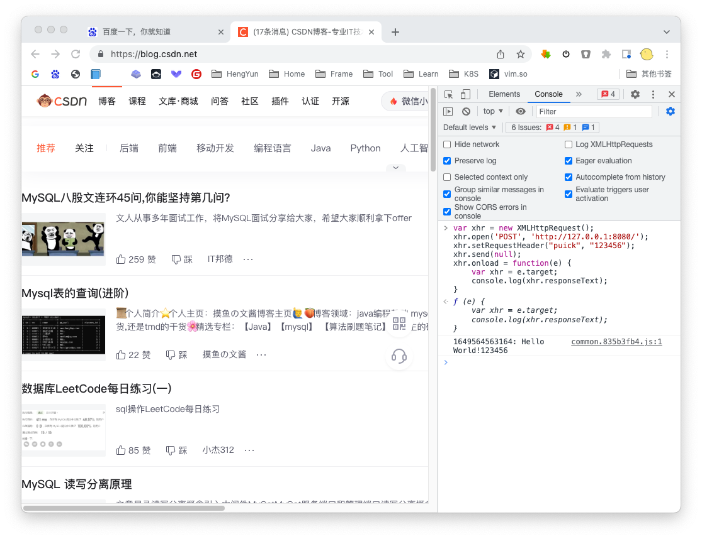

# puick-web-cors-sample

在任意网站中访问控制台,使用以下内容即可测试是否跨域。

```javascript
var xhr = new XMLHttpRequest();
xhr.open('GET', 'http://127.0.0.1:8080/');
xhr.setRequestHeader("puick", "123456");
xhr.send(null);
xhr.onload = function(e) {
    var xhr = e.target;
    console.log(xhr.responseText);
}
```


